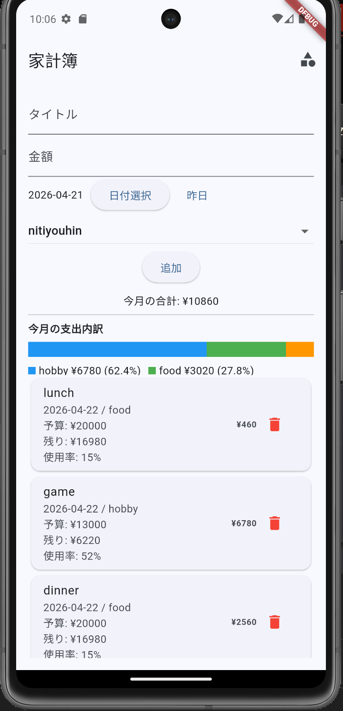
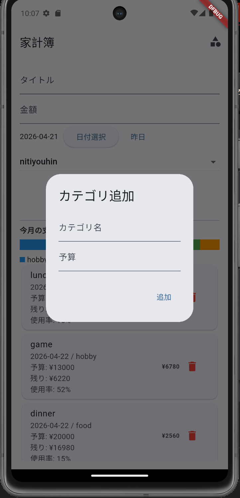
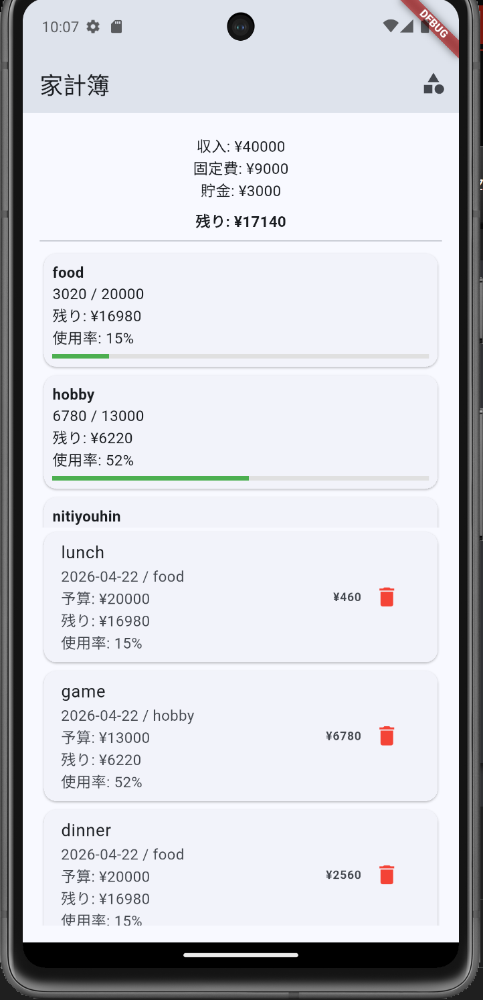

# 💸 家計簿アプリ

## 🚀 概要
Flutter + FastAPIで作成した家計管理アプリ

---

## ✨ 機能
・支出登録  
・カテゴリ管理  
・予算設定  
・月別集計  
・カテゴリ別使用率表示  

---

## 🧠 特徴

  
  
  

---

## ⚙️ 技術スタック
- Frontend: Flutter  
- Backend: FastAPI  
- DB: SQLite  
